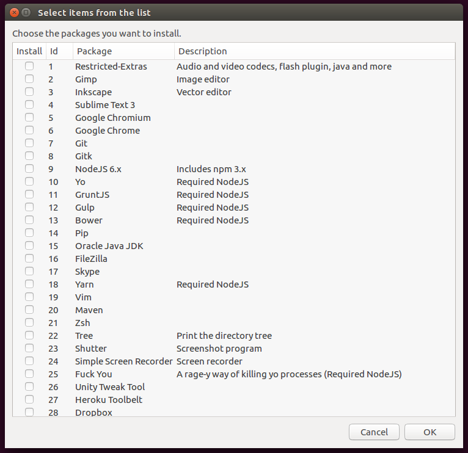

# Notebook Bootstrap

My Personal SETUP

## Preview:

## List of applications

[View application list](https://github.com/brenopolanski/notebook-bootstrap/blob/master/APPLICATIONS.md)

## Installation

1. Clone this repository:

    git clone git@github.com:brenopolanski/notebook-bootstrap.git

2. Access the directory and add the execute permission through the command below:

    sudo chmod +x install.sh

3. Run the file:

    ./install.sh

## Other Applications

### Sublime Packages and Snippets

#### Packages

- Sublime Text 2/3 Markdown Preview [[Download](https://github.com/revolunet/sublimetext-markdown-preview)]
- Color Highlighter [[Download](https://github.com/Monnoroch/ColorHighlighter)]
- CSS comments [[Download](https://github.com/brenopolanski/css-comments-sublime-snippets)]
- JavaScript and CoffeeScript Console snippets [[Download](https://github.com/caiogondim/js-console-sublime-snippets)]
- CSScomb for Sublime Text [[Download](https://github.com/csscomb/sublime-csscomb)]
- PlainTasks [[Download](https://github.com/aziz/PlainTasks)]
- Theme Cobalt 2 [[Download](https://github.com/wesbos/cobalt2)]
- GitGutter [[Download](https://github.com/jisaacks/GitGutter)]
- FileDiffs [[Download](https://github.com/colinta/SublimeFileDiffs)]
- Underscore.js Snippets for Sublime Text 2/3 [[Download](https://github.com/AntouanK/sublime-underscorejs-snippets)]
- Stylus Clean Completions [[Download](https://github.com/lnikell/stylus-clean-completions)]

### Chrome application and extension

#### Application

- Dimensions Legacy [[Download](https://chrome.google.com/webstore/detail/dimensions-legacy/hdmihohhdcbejdkidbfijmfehjbnmifk?utm_source=chrome-ntp-icon)]
- Edge: The Web Ruler [[Download](https://chrome.google.com/webstore/detail/edge-the-web-ruler/njlkegdphefeellhaongiopcfgcinikh?utm_source=chrome-ntp-icon)]
- Small PDF [[Download](https://chrome.google.com/webstore/detail/merge-pdf-smallpdfcom/nbhibnjbbdkflfklbdpgbifkhcielgcm?utm_source=chrome-ntp-icon)]
- Postman - REST Client [[Download](https://chrome.google.com/webstore/detail/postman-rest-client/fdmmgilgnpjigdojojpjoooidkmcomcm?utm_source=chrome-ntp-icon)]

#### Extension

- ColorZilla [[Download](https://chrome.google.com/webstore/detail/colorzilla/bhlhnicpbhignbdhedgjhgdocnmhomnp?utm_source=chrome-ntp-icon)]
- GitHub Notifier [[Download](https://chrome.google.com/webstore/detail/github-notifier/lmjdlojahmbbcodnpecnjnmlddbkjhnn?utm_source=chrome-ntp-icon)]
- Strict Workflow [[Download](https://chrome.google.com/webstore/detail/strict-workflow/cgmnfnmlficgeijcalkgnnkigkefkbhd?utm_source=chrome-ntp-icon)]
- AdBlock [[Download](https://chrome.google.com/webstore/detail/adblock/gighmmpiobklfepjocnamgkkbiglidom?utm_source=chrome-ntp-icon)]
- Merge Windows [[Download](https://chrome.google.com/webstore/detail/merge-windows/kbpinmnkhfkoidiinmapkhifnfoiklkb?utm_source=chrome-ntp-icon)]
- GitHub Linker [[Download](https://chrome.google.com/webstore/detail/github-linker/jlmafbaeoofdegohdhinkhilhclaklkp)]
- React Developer Tools [[Download](https://chrome.google.com/webstore/detail/react-developer-tools/fmkadmapgofadopljbjfkapdkoienihi)]
- Redux DevTools [[Download](https://chrome.google.com/webstore/detail/redux-devtools/lmhkpmbekcpmknklioeibfkpmmfibljd/related?hl=en-US)]
- Form Save And Restore [[Download](https://chrome.google.com/webstore/detail/form-save-and-restore/jknhanfpdjpnkfjjkpofcpegcbhpigcd)]

## After Install

### Configure Git

- Copy .ssh folder of OneDrive for computer (path: ~/.ssh/)
  * Add permission in file: `chmod 400 ~/.ssh/id_rsa`
  * Test the connection: `ssh -T git@github.com`
  * Setting your username in Git [[Link](https://help.github.com/articles/setting-your-username-in-git/)]
  * Setting your email in Git [[Link](https://help.github.com/articles/setting-your-email-in-git/)]

### Configure Sublime Text

- Install package control [[Download](https://sublime.wbond.net/installation#st3)]

### Configure OH My ZSH

- Theme Bullet Train [[Download](https://github.com/caiogondim/bullet-train-oh-my-zsh-theme)]
- Powerline fonts [[Download](https://github.com/powerline/fonts)]

## Contributing

1. Fork it!
2. Create your feature branch: `git checkout -b my-new-feature`
3. Commit your changes: `git commit -m "Add some feature"`
4. Push to the branch: `git push origin my-new-feature`
5. Submit a pull request  :)

English is the universal language nowadays, so please don't create or comment on issues using another language.

## License

[MIT License](http://brenopolanski.mit-license.org/) © Breno Polanski
